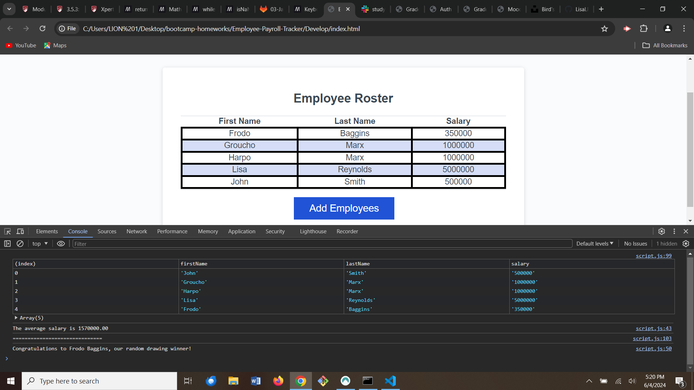

# Employee Payroll Tracker

## Description

This is a web application that allows employee payroll data to be entered, viewed, and managed. It produces a grid that displays the employees' first name, last name, and salary.

## Installation

N/A

## Usage

To begin, click on the blue "Add Employees" button. A pop-up will appear at the top of the page that will give directions on what data to enter. Once all employees' information has been entered, the user may choose "cancel" to end data entry. This will prompt a table to show in the browser with all employees' information.

The user may also open Chrome DevTools by right-clicking anywhere on the page, scrolling down to and clicking on "Inspect." A console panel will appear either on the side or bottom of the webpage. Be sure to click on "Console" along the edge of the console panel in order to view the console log. Here the table can be viewed again, along with the average salary, and the random drawing winner.

Screen Shot: 

Link: https://lisalreynolds.github.io/Employee-Payroll-Tracker/
